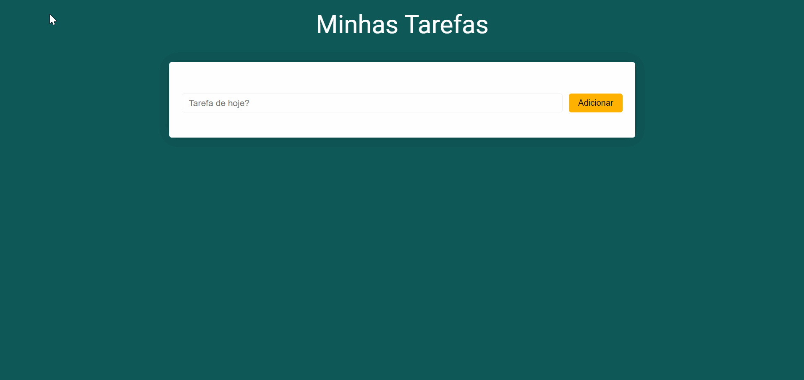

<h1 align="center">Aplicação Web - Minhas Tarefas</h1>



## Descrição
- Projeto de estudo em VueJS.
Lista de tarefas com opções de incluir e excluir. Quando há mais que 4 tarefas pendentes, o número de tarefas fica vermelho como alerta. Se fecharmos a página ou recarregarmos, as tarefas continuarão como antes pois são salvas no localStorage.  

## Status

⚡✅  Finalizado - Concluído  ✅⚡


# minhas-tarefas

## Project setup
```
npm install
```

### Compiles and hot-reloads for development
```
npm run serve
```

### Compiles and minifies for production
```
npm run build
```

### Lints and fixes files
```
npm run lint
```

### Customize configuration
See [Configuration Reference](https://cli.vuejs.org/config/).
